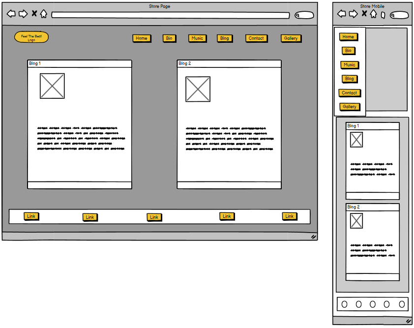

# Band Grooves (PP5 Paul Gleeson: Code Institute)

# Project Links
* [Band Grooves Repository](https://github.com/Shaga-Matula/Band-Grooves)
* [Band Grooves Heroku Site](https://bandgrooves-0de2aec37e72.herokuapp.com)

# Project Discription

* Blue Pulse is a band that creates soulful music that touches the heart and soul of its listeners. The official website of the band offers a range of features that cater to the needs of its fans and potential new listeners. 

* The website has a menu with different sections, including Home, Bio, Music, Store, Blog, and Contact. 

* The Home section is the landing page of the website, where you can find a brief introduction to the band and their latest news. 

* The Bio section provides a detailed history of the band, their members, and their musical influences. 

* The Music section contains our latest tracks and links to our music on various platforms, making it easy for fans to access their music. 

* In the Store section, fans can buy their merchandise, including t-shirts, posters, and CDs, to show their support for the band. 

* The Blog section is where the band shares their thoughts on music, life, and everything in between, providing a glimpse into their personal lives and creative process. 

* Finally, in the Contact section, fans can send them a message, book them for a gig, or just say hello, making it easy for fans to connect with the band. 

* The website is designed to provide a comprehensive overview of the band and their music to their fans and potential new listeners, making it easy for them to stay up-to-date with the band's latest news and events.

# Design 
* (Please note this is a MVP and color and framing may change during the project)

## Blue Pulse Design Goals

### When designing this website for the music band Blue Pulse, its best to keep in mind the band's personality and the mood of their music. Here are some design principles that will be applied to Blue Pulse's website:

* Use Simple Backgrounds: The best music website designs often feature simple backgrounds, with the content customized to fit an artist's personality and the mood of their music.

* Showcase Professional Photos: Blue Pulse will use professional photos to showcase the band's image and personality.

* Add Clear Call-to-Action: Attention is fleeting, so it is important to choose one important thing to highlight and add a clear call-to-action.

* Customize the Template: Blue Pulse will customize the website template to reflect the band's personality and style.

* Design for Responsive Viewing: The website will be designed to be responsive, meaning it will be easily accessible and viewable on different devices, including desktops, laptops, tablets, and smartphones.

* Ensure Easy Navigation: The website will have a clear and easy-to-use navigation menu that allows users to quickly find what they are looking for.

* Maintain Consistent Branding: The website will have consistent branding, including the use of the band's logo, colors, and fonts.

* Create Engaging Content: Blue Pulse will create engaging content, including the band's latest news, music, and merchandise. The blog section will provide a glimpse into the band's personal lives and creative process.

* Integrate Social Media: The website will be integrated with the band's social media accounts, making it easy for fans to follow and engage with the band on different platforms.

* Overall, the design of Blue Pulse's website will reflect the band's personality and style, while providing a comprehensive overview of the band and their music to their fans and potential new listeners. By using "will" instead of "should," the band is making a commitment to take action and achieve their goals in designing their website.

## Blue Pulse Balsamic Mockup 
* Blue Pulse's website will have a unique design that includes balsamic drawings to showcase the band's personality and style. The website will have different sections, including Home, Bio, Music, Store, Blog, and Contact. Here is a description of each section:

### Landing Page/Home: 
* The landing page Balsamic Drawing: This page reflects the mood and personality of the band. It will also include a brief introduction to the band and their latest news.

### Music Page
* Music Page Balsamic Drawing: This page reflects the mood and style of the band's music. It will contain their latest tracks and links to their music on various platforms, making it easy for fans to access their music.

### Store Page
* Store Page Balsamic Drawing : In this section, fans can buy their merchandise, including t-shirts, posters, and CDs, to show their support for the band. The balsamic drawing helps to showcase the band's merchandise and reflect their style during devolopment.

### Blog Page
* Blog Page Balsamic Drawing : This section will have a page that reflects the band's personal lives and creative process. It is where the band shares their thoughts on music, life, and everything in between using the guid of Balsamic Drawings.

### Contact Page
*  Contacts Page Balsamic Drawing: In this section, fans can send them a message, book them for a gig, or just say hello, making it easy for fans to connect with the band. The balsamic drawing will help devolop the page to reflect the band's personality and style.

### Overall, the design of Blue Pulse's website using balsamic drawings as a design tool will guide and reflect the band's personality and style, while providing a comprehensive overview of the band and their music to their fans and potential new listeners.

### COLOR Pallet

* Thankyou to HookAgency for Pallett idea. 
* [Link to HookAgency](https://hookagency.com/blog/web-design-color-palettes/)

# Blue Pulse E-Commerce Platform

The Blue Pulse band merchandise and CD download project is distinctly aligned with a Business-to-Consumer (B2C) e-commerce model for the following reasons:

Direct Sales to Consumers:

The essence of your platform lies in the direct sale of Blue Pulse merchandise (such as T-shirts, hoodies, and hats) and digital downloads (CD) directly to individual consumers. This direct transactional approach caters specifically to Blue Pulse fans, music enthusiasts, and collectors who are the end consumers of the band's products.
Consumer-Focused Features:

The platform is meticulously crafted with consumer-centric features, including an online store that showcases a variety of merchandise categories. The direct purchase options are tailored to the preferences and needs of individual consumers, ensuring a personalized and engaging shopping experience.
Community Engagement:

A key aspect of your project is the emphasis on community engagement. Through user accounts, profiles, and comments, the platform facilitates direct interaction with individual consumers. This community-driven approach aligns with the B2C model, fostering a sense of belonging among Blue Pulse fans and creating a space for them to actively participate in the band's community.
User Experience:

The design and functionality of your platform are thoughtfully designed to prioritize user experience. The seamless and enjoyable shopping experience is tailored to individual consumers, providing them with easy navigation, visually appealing displays, and a user-friendly interface. This focus on enhancing the user experience contributes to the overall success of your B2C e-commerce model.
While elements of the Direct-to-Consumer (D2C) model are incorporated, especially in your efforts to establish a direct connection with Blue Pulse fans, the overarching structure and emphasis on catering directly to individual consumers solidify your project's classification within the B2C e-commerce category.

## Overview

Blue Pulse E-Commerce is an online platform dedicated to providing fans and music enthusiasts with a seamless shopping experience for Blue Pulse band merchandise and music. Our business model is centered around delivering high-quality products, fostering community engagement, and promoting the unique musical journey of Blue Pulse.

## Target Audience

Our primary target audience includes:
- **Blue Pulse Fans:** Individuals who appreciate the musical talent and unique sound of Blue Pulse.
- **Music Enthusiasts:** People who enjoy rock and blues genres and are interested in supporting independent artists.
- **Collectors:** Fans who are passionate about collecting band merchandise and limited edition items.

## Products

We offer a diverse range of products, including:
- **Merchandise:** T-shirts, hoodies, hats, and other apparel featuring exclusive Blue Pulse designs.
- **CD Downloads:** Digital downloads of the Blue Pulse Anthology CD, allowing fans to enjoy the band's music anytime, anywhere.

## Pricing

Our pricing strategy is designed to be competitive and fair:
- **Merchandise:** Prices vary based on the type of product, with occasional discounts or promotions for loyal customers.
- **CD Downloads:** Priced affordably to make Blue Pulse's music accessible to a wider audience.

## Marketing Strategies

To reach and engage our audience, we employ the following marketing strategies:
- **Social Media Presence:** Active on platforms like Instagram, Twitter, and Facebook to share updates, behind-the-scenes content, and promotions.
- **Email Campaigns:** Periodic newsletters to subscribers with exclusive offers, new product announcements, and band news.
- **Collaborations:** Partnering with influencers, music bloggers, and other brands to expand our reach and connect with new audiences.
- **SEO Optimization:** Ensuring our online store is search engine optimized to attract organic traffic.

## How to Contribute

We welcome contributions to enhance the user experience, add new features, or improve existing ones. Feel free to submit pull requests or open issues.

Thank you for supporting Blue Pulse and being part of our online community!

# Features

## Agile Aproach

* The Agile approach is a flexible project management methodology that emphasises collaboration and iterative development. It is widely used in software development but can be applied to various industries and projects. The Agile approach focuses on delivering value to customers through incremental and frequent delivery of small chunks of functionality. One of the key components of the Agile approach is the use of user stories, which are short descriptions of what a user wants to achieve with a product or service. User stories follow a specific format: "As a [user], I want to [action], so that I [outcome]". The use of user stories helps to capture the user's perspective and prioritise work.

* In GitHub, labels are used to categorize issues and pull requests. They can help you keep track of what needs to be done and what's already been done. I have created some labels and used some of the default ones. Labels can be used to indicate the priority of an issue, the type of issue, or the status of an issue. For example, "bug", "enhancement", "high priority", "in progress", or "done".

## User Stories

* The user story template in this project is a widely used format for defining user requirements in Agile software development. The template follows the format of "As a [user], I want to [action], so that [outcome]". The template is used to capture user requirements in a concise and structured manner, making it easier for the development team to understand and implement them.
* The user story template in this project includes three sections: Estimation Effort, Tasks, and Acceptance Criteria. The Estimation Effort section uses the Fibonacci sequence to estimate the amount of effort required to complete each task. The Tasks section lists the specific tasks that need to be completed to achieve the user story. The Acceptance Criteria section lists the criteria that must be met for the user story to be considered complete.
* The use of the Fibonacci sequence in the Estimation Effort section is a common practice in Agile software development. The Fibonacci sequence is a numerical sequence in which each number is the sum of the two preceding numbers. The sequence is often used in Agile software development to estimate the amount of effort required to complete a task. The sequence is used because it allows for a more accurate estimation of effort, as it takes into account the uncertainty and complexity of software development.
* The user story template in this project is a useful tool for Agile software development teams. It provides a structured and concise format for capturing user requirements and helps to ensure that the development team understands and implements them correctly. By using this template, the development team can work more efficiently and effectively, resulting in a higher quality product that meets the needs of the users.

## User Stories for Blue Pulse's Website with Agile Style:
* As a new visitor to Blue Pulse's website, I want to easily navigate the website menu, so that I can quickly find the information I am looking for.
* As a fan of Blue Pulse, I want to be able to listen to their latest tracks and access their music on various platforms, so that I can enjoy their music easily.
* As a potential customer of Blue Pulse's merchandise, I want to be able to view their merchandise and purchase it easily, so that I can show my support for the band.
* As a fan of Blue Pulse, I want to be able to read their latest news and blog posts, so that I can stay up-to-date with the band's activities and creative process.
* As a potential customer of Blue Pulse, I want to be able to contact the band easily, so that I can book them for a gig or send them a message.
* As a member of Blue Pulse, I want to be able to customize the website template to reflect the band's personality and style, so that the website accurately represents the band.
* As a member of Blue Pulse, I want to be able to integrate the website with the band's social media accounts, so that fans can easily follow and engage with the band on different platforms.
* As a member of Blue Pulse, I want to be able to create engaging content for the website, including the band's latest news, music, and merchandise, so that fans can stay up-to-date with the band's activities.
* As a member of Blue Pulse, I want to be able to ensure that the website is designed to be responsive, so that it is easily accessible and viewable on different devices, including desktops, laptops, tablets, and smartphones.
* As a member of Blue Pulse, I want to be able to maintain consistent branding throughout the website, including the use of the band's logo, colors, and fonts, so that the website accurately represents the band's personality and style.

## These user stories can help guide the development of Blue Pulse's website with an agile style, ensuring that the website meets the needs of the band's fans and potential customers.

# Technologies

## Coding Languages
* HTML
* CSS
* Python 3
* Javascript

## Technologies Used
* Git - Version control system.
* GitHub - Managing Git repositories.
* Gitpod - Development environment.
* Icon library for producing icons on websites.
* Google Fonts - Collection of free, open-source fonts for importing into websites.
* Psycopg2 - PostgreSQL adapter for Python.
* Django 3.2.16 - A Python web framework for rapid development.
* Gunicorn - Python HTTP server for WSGI applications.
* Heroku Platform - A cloud-based platform for deploying and managing web applications.
* Crispy Forms - A Python package for formatting forms in Django.
* Website Mockup Generator - A tool for creating mockups of websites on different screen sizes.
* Balsamiq - A wireframing tool for producing mockups of websites.
* Bootstrap 5 - A front-end framework for building responsive websites.
* AWS - A cloud-based image and video management platform for storing media assets.
* Microsoft Paint - Editor for images
* Microsoft Word 2010
* Responsinator 
* QuickDBD 

## Validation
* WC3 Validator - Used to validate the HTML code of the site.
* Jigsaw W3 Validator- Used to validate the CSS of the site.
* Jshint - Used to validate the Javascript of the site.
* Pycodestyle - Used to validate code against Python conventions.
* Chrome dev tools (Lighthouse) - Used to measure site performance, SEO and accessibility.
* WAVE Validator - Used to evaluate site accessibility

## keyword, Description(Meta)
#####################
#####################

## Deployment

## Version Control
- The Site was created using gitpod workspace and pushed to github.
- git add . - This command was used to add the file(s) to the staging area before they are committed.
- git commit -m “commit message” - This command was used to commit changes to the local repository queue ready for the final step.
- git push - This command was used to push all committed code to the repository on github.

## Heroku 

- Requirement and Procfile
- Before deployment on Heroku, two files need to be created and be up to date, a requirements.txt file and a Procfile.
- The requirements.txt file is created by executing the following command in the terminal window:  pip3 freeze --local > requirements.txt. A file with all requirements will be  created.
- Then create a file named Procfile and insert the following code: web: gunicorn welovedogs.wsgi, with no empty lines after it.
- Then make sure to push these files to your repository.

## Creating Heroku App

- Log into Heroku and go to the Dashboard.
- Click "New" and then select "Create new app".
- Give your app a name and select the region closest to you.
- Click "Create app" to confirm.
- Creating a database

## ElephantSql

- Log into ElephantSQL.com and access your dashboard.
- Click "Create New Instance"
- Set up a plan, give your plan a Name, select the Tiny Turtel (Free) plan, leave the Tags field blank.
- Select "Select Region" and select a data center new you.
- Click "Review".
- Confirm your details and then click "Create instance".
- Return to the ElephantSQL dashboard and click on the database instance name for this project.
- In the URL section, click the copy icon to copy the database URL.
- In your workspace make sure django and gunicorn are installed by running pip3 install 'django<4' gunicorn.
- Equally make sure that infrastructure for the database is installed by running pip3 install dj_database_url===0.5.0 psycopg2.
- Update the requirements.txt file if needed.

## env.py file

- If you do not have a env.py file in your workspace create one and make sure it is included in the .gitignore file.
- At the top of the env.py file add the line: import os.
- Below that add the following two lines:
- os.environ["DATABASE_URL"] = "<copied URL from SQL database>"
- os.environ["SECRET_KEY"] = "<create a secret key of your own>"

## AWS storage:
#########################
#########################

## Setting Environment Variables

- On the Heroku Dashboard select the app you just created and then select the "Settings" tab.
- Click "Reveal Config Vars"
- Add the following config vars:
    - DATABASE_URL - copy the database URL from ElephantSQL in here, it should also be in the env.py file.
    - SECRET_KEY - copy your secret key in here.
    - Cloudinary storage you also need to copy your personal CLOUDINARY_URL into these fields.
    - In addition, you may need the key PORT with value 8000.

## Connecting to GitHub and Deploy

- On the Heroku Dashboard select the app you just created and then select the "Deploy" tab.
- Select GitHub for the deployment method.
- Search for the name of the project repository and click "Connect".
- Further down the page, select "Enable Automatic Deploys" if desired.
- Then finally further down, select "Deploy Branch" and watch the app being built.

## Forking the Repository
- Log in to GitHub and locate the GitHub repository you want to fork.
- At the top of the Repository above the "Settings" Tab on the menu, locate the "Fork" Button and click it.
- You will have a copy of the original repository in your GitHub account.
- You will now be able to make changes to the new version and keep the original safe.

## Making a Local Clone
- Log into GitHub and locate the repository you want to clone.
- Click the 'Code' dropdown above the file list.
- Copy the URL for the repository.
- Open Git Bash in your IDE.
- Change the current working directory to the location where you want the cloned directory.
- Type git clone in the CLI and then paste the URL you copied earlier. This is what it should look like: $ git clone https://github.com/
- Press Enter to create your local clone.
- Install all of the packages listed in the requirements file you can use the following command in the terminal pip install -r requirements.txt which will do it for you.