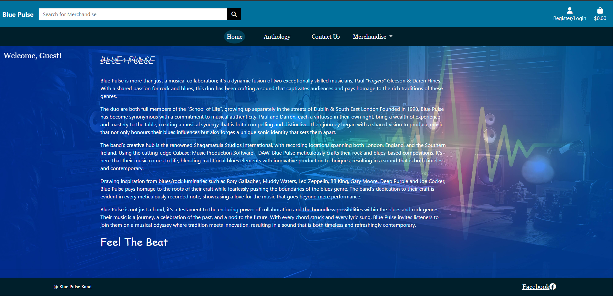
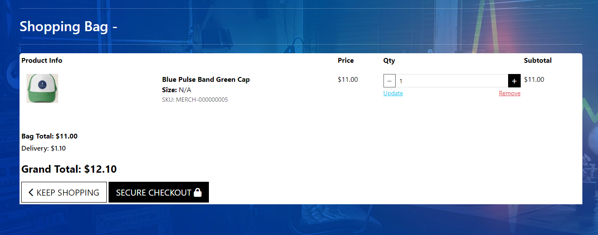
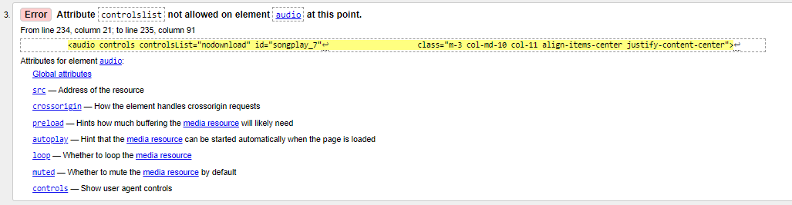
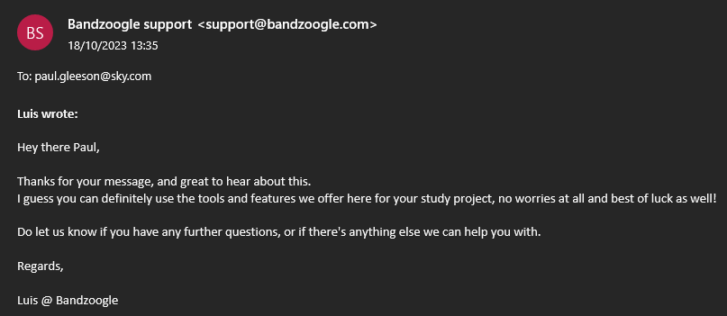

# Blue Pulse (PP5 Paul Gleeson: Code Institute)

# Project Links

- [Blue Pulse Repository](https://github.com/Shaga-Matula/blue-pulse-pp5)
- [Blue Pulse Live Site](https://bluepulsepp5-165b4a2f3a08.herokuapp.com)

## Note on Business Model

- The design approach for the music store (Anthology section) incorporates 10-second previews for each song to enhance user interaction. This aims to provide users with a glimpse into the musical journey while encouraging them to consider acquiring the complete CD. The interface is designed to smoothly lead users through the informative process, highlighting the overall value of the music collection.

- In the context of this project, all songs have been released for perusal, but in a live environment, users would encounter 10-second samples with complete versions available for more in-depth exploration of the songs. The store would also greatly appreciate any feedback regarding the songs.

# Table of Contents

1. [Introduction](#introduction)
2. [Project Description](#project-description)
3. [How to Use the Site](#how-to-use-the-site)
   - [Navigation Overview](#navigation-overview)
     - [Welcome to Blue Pulse!](#welcome-to-blue-pulse)
     - [Design](#design)
     - [Introduction](#introduction-1)
     - [Landing Page](#landing-page)
     - [Brief Description of the Dropdown Menu](#brief-description-of-the-dropdown-menu)
     - [Product Management (For Superusers)](#product-management-for-superusers)
     - [User-specific Options](#user-specific-options)
     - [Authentication Options](#authentication-options)
     - [Facebook link](#Facebook-link)
   - [Landing Page](#landing-page)
     - [Easy Navigation](#easy-navigation)
     - [User Account Icons](#user-account-icons)
     - [Responsive Design](#responsive-design)
     - [Visual Appeal](#visual-appeal)
     - [Meta Information for SEO](#meta-information-for-seo)
     - [Subtle Communication](#subtle-communication)
     - [Personal Greeting](#personal-greeting)
     - [Consistency](#consistency)
     - [Footer](#footer)
     - [Additional Features](#additional-features)
     - [Summary](#summary)
4. [Anthology](#anthology)
   - [Blue Pulse Anthology](#blue-pulse-anthology)
   - [Song Collection](#song-collection)
   - [Immersive Song Cards](#immersive-song-cards)
   - [Audio Functionality](#audio-functionality)
   - [User-Friendly Interface](#user-friendly-interface)
   - [Superuser Privileges (CRUD)](#superuser-privileges-crud)
   - [Interactive Deletion](#interactive-deletion)
   - [Responsive Design (Anthology)](#responsive-design-anthology)
   - [In Summary](#in-summary-anthology)
5. [Contact Page](#contact-page)
   - [Direct Communication](#direct-communication)
   - [User-Friendly Form](#user-friendly-form)
   - [Newsletter Subscription](#newsletter-subscription)
   - [Responsive Design (Contact Us)](#responsive-design-contact-us)
   - [Communication Options](#communication-options)
   - [In Summary](#in-summary-contact-us)
6. [Comments Page](#comments-page)
   - [Commented Songs](#commented-songs)
   - [Comment Display](#comment-display)
   - [User Interaction](#user-interaction)
   - [Timestamps](#timestamps)
   - [Editing and Deletion](#editing-and-deletion)
   - [Add Comment Feature](#add-comment-feature)
   - [User CRUD Operations](#user-crud-operations)
   - [Toast Notifications](#toast-notifications)
   - [Scroll Position Persistence](#scroll-position-persistence)
   - [In Summary (Comments)](#summary-comments)
7. [Design](#design)
   - [Blue Pulse Design Goals](#blue-pulse-design-goals)
   - [Blue Pulse Balsamic Mockup](#blue-pulse-balsamic-mockup)
   - [COLOR Pallet](#color-pallet)
8. [Blue Pulse E-Commerce Platform](#blue-pulse-e-commerce-platform)
   - [Overview](#overview)
   - [Target Audience](#target-audience)
   - [Products](#products)
   - [Pricing](#pricing)
   - [Marketing Strategies](#marketing-strategies)
   - [How to Contribute](#how-to-contribute)
9. [Database Design](#database-design)
   - [Blue Pulse Database](#blue-pulse-database)
   - [Entities](#entities)
   - [Relationships](#relationships)

# Introduction

- 

- The creator of the Blue Pulse project is Paul Gleeson, student at Code Institute. This project takes a lighthearted approach to present a fictional band named Blue Pulse. Although the band itself is a creation of imagination (Fingers Gleeson), the music is authentic, recorded by the group in home studios over the years.

- The primary objective is to share the music far and wide, with the hope that someone might like a song or two, potentially paving the way to record these tracks professionally in a genuine music studio. The visuals, including merchandise and branding, have been crafted with the permission of My Free Logo, adding a polished feel. Also all the art work that enhance the music store section will be listed in a following sections that enhance the music store section with a big thankyou.

# Project Description

- Blue Pulse is a band that creates soulful music for its listeners. The official website of the band offers a range of features that cater to the needs of its fans.

- The website nav menu has different sections, including Home, Comments, Anthology (music section), Store, Newsletter, and Contact.

- The Home section is the landing page of the website, where you can find a brief introduction to the band and their latest news.
- The Music Anthology section contains our latest tracks and links to our music on various platforms, making it easy for fans to access their music.
- In the Store section, fans can buy their merchandise, including t-shirts, posters, and CDs, to show their support for the band.
- The Comments/Discussion section is where the band shares their thoughts on music, life, and everything in between, providing a glimpse into their personal lives and creative process.
- Finally, in the Contact section, fans can send them a message, book them for a gig, or just say hello, making it easy for fans to connect with the band and join a newsletter.
- The website is designed to provide a comprehensive overview of the band and their music to their fans and potential new listeners, making it easy for them to stay up-to-date with the band's latest news and events and hopefully paving the way for the band to recording the songs in a music studio.

# Navigation Overview

## Blue Pulse Website Navigation

### Description Top Bar and Dropdown Menu

## Top bar:

- At the pinnacle of the page, the search engine is placed to explore merchandise within the dedicated merchandise section. Simultaneously, the logo functions as a convenient home page marker, ensuring good navigation.

- Adjacent to the search bar, on the right-hand side, a login/register button is strategically positioned. Noteworthy is its dynamic transformation to "My Profile" upon user login, enhancing user experience and providing quick access to personalized settings.

**Product Management (For Superusers):**

- If the logged-in user is a superuser (administrator with special privileges), they will see links for product management functionalities:
  - **"Product Management":** Directs to the admin dashboard.
  - **"Add Merchandise":** Navigates to the page for adding new merchandise.
  - **"Add Song":** Redirects to the page for adding a new song.

**User-specific Options:**

- For all authenticated users (both regular users and superusers):
  - **"My Profile":** Takes the user to their profile page.
  - **"Logout":** Logs the user out of their account.

**Authentication Options:**

- For users who are not authenticated (not logged in):

  - **"Register":** Links to the registration page.
  - **"Login":** Links to the login page.

- These options are presented in a dropdown menu, offering a convenient and organized way for users to access various functionalities based on their authentication status and user type.

- **Brand Logo:** The Blue Pulse logo is placed at the left corner, linking to the home page.
- **Search Bar:** A search bar is included, allowing users to search for merchandise easily.
- **Login/Logout:** The user account status is displayed on the right side, providing options to log in, register, or access account-related features.

## Navbar:

- **Navigation Links:** Home, Anthology, Contact Us, Comments (if the user is authenticated), and Merchandise dropdown.

- **Merchandise Dropdown:** Provides links to different merchandise categories (All Merchandise, Clothes, Memorabilia, Anthology CD).

## Styling:

- **Color Scheme:** The color scheme is consistent with a blue background, maintaining a visually appealing design.
- **Fonts:** Various fonts are used for different elements, providing a distinctive style.
- **Hover Effects:** Hover effects on navigation links enhance user interaction.
- **Bootstrap Components:** Utilizes Bootstrap components for styling and responsiveness.

# Blue Pulse Site Guide

# Landing Page

- Simply navigate to the [Heroku link](https://bluepulsepp5-165b4a2f3a08.herokuapp.com), and it will bring you to the first page (landing page). This page serves as an introduction to the band and an invitation to continue exploring the rest of the site for a nice musical experience. One of the main purposes of the page is to help fans navigate using the navigation bar.

## Easy Navigation

- A simple top navigation bar serves as a guide to key sections of Blue Pulse. Quick links to the home page, song anthology, contact details, and merchandise categories are readily available. User-friendly options, including account management, are integrated to enhance the overall navigation area.

## User Account Icons

- Icons at the top right provide easy access to account features. For logged-in users, there is a link to manage their profile. For those not logged in, there is a link to access account functionalities.

## Responsive Design

- The landing page features responsive design, adapting to various screen sizes with the use of Bootstrap and CSS. This ensures a consistent experience for visitors on desktops, tablets, and mobile devices.

## Visual Appeal

- Chosen icons and images, including FontAwesome icons and the distinctive Blue Pulse favicon, contribute to the visuals. These elements aim to reinforce the Blue Pulse brand and establish a memorable identity with the fans.

## Meta Information for SEO

- The `<head>` section contains meta information, optimizing for search engines (SEO). This enhances visibility and ensures that Blue Pulse is accurately represented in search engine results. Visitors can easily share the essence of Blue Pulse on various social media platforms.

## Subtle Communication

- Toast notifications discreetly communicate with visitors, providing quick updates, celebrating successes, or conveying important information. The goal is to keep visitors informed without disrupting their exploration of the platform.

## Personal Greeting

- The landing page offers a personalized experience. Depending on authentication status, visitors receive a warm and inviting greeting, adding a personal touch to their interaction with Blue Pulse. On smaller screens, the personalized greeting will fade away to prevent overcrowding and prioritize the essential user-friendly interface.

- The design is made to work well on different devices so that everyone visiting Blue Pulse can easily see and use it. It's set up to give the best view and interaction, whether you're on a big computer screen or a smaller one like a phone.

## Consistency

- Consistency in styling, covering fonts to stylesheets, presents the Blue Pulse landing page as a cohesive and stylish entity. The objective is to provide visitors with a visually harmonious experience that aligns with the rhythm of Blue Pulse.

## Footer

**Facebook link:**

- This live link is strategically placed for users to easily access Blue Pulse's Facebook profile, fostering social media engagement. The utilization of the "nofollow" attribute in the link is intentional, signaling to search engines not to influence the linked page's ranking. The button design and FontAwesome integration contribute to a visually appealing and interactive experience, aligning with the overall aesthetics of the Blue Pulse project. This inclusion not only enhances user connectivity but also supports SEO efforts by integrating social media presence into the project's documentation.

## Additional Features:

- **User Greeting:** A personalized greeting is displayed based on whether the user is authenticated.
- **Shopping Bag Icon:** Displays the total value of items in the user's shopping bag.
- **Styling and Responsiveness:** The navigation is styled using Bootstrap, making it responsive for various screen sizes.
- **Messages Alert:** Notifications and messages are displayed at the top of the page.
- **Footer:** Includes social media links and copyright information and facebook link.

## Summary

- The Blue Pulse landing page is designed to hopufully ensure a smooth and enjoyable interaction for visitors. From responsive design to personalized greetings and discrete messaging each element contributes to creating a user-friendly environment on the Blue Pulse platform, while also optimizing for SEO.

# Anthology

## Blue Pulse Anthology

# Song Collection

- The Blue Pulse Anthology serves as a comprehensive platform for managing the songs. Utilizing CRUD (Create, Read, Update, Delete) functionality, it allows easy perusal to the collection.

## Immersive Song Cards

- Art photos were used from [Unsplash](https://unsplash.com) to enhance the experience with visually compelling song cards (the artists will be listed later on). Each card, supported by CRUD operations when logged in as a superuser, features images, artist names, and song titles, providing insights into the song crafted by Blue Pulse.

## Audio Functionality

- Access audio controls for each song, allowing for a straightforward listening experience directly on the Anthology page. CRUD functionality ensures efficient updates and maintenance of the audio content. Additionally, a small JavaScript script is implemented to ensure only one song can be played at a time.

## User-Friendly Interface

- Designed for user convenience, the Anthology page incorporates a simple audo mackinisem in to allow operations for easy navigation, enabling users to explore, play and listen to the music.

## Superuser Privileges (CRUD)

- Superusers benefit from additional CRUD functionalities, such as editing song details and secure deletion with a confirmation prompt, offering efficient management of the Anthology content.

## Interactive Deletion

- The deletion process is deliberate, requiring confirmation to ensure conscious decision-making. CRUD operations play a crucial role in maintaining the integrity of the Anthology collection.

## Responsive Design (Anthology)

- Similar to our landing page, the Anthology page features a responsive design, adapting to various devices for a consistent user experience during interactions.

## In Summary

- In summary, the Blue Pulse Anthology page has CRUD functionality for superusers and serves as a robust platform for exploring, managing, and interacting with the musical collection.

- "Users can navigate, listen, and connect with the narratives embedded in each song, contributing to the vibrant tapestry of our musical journey."

# Merchandise

- Each product is showcased with detailed information, including name, price, category, and a user-friendly rating system.

- The Merchandise page serves as the gateway to the diverse collection of products, offering an extensive range that caters to various sizes and colors. By simply clicking on the desired item, the page loads, isolating the user's choice and providing a "visually appealing" and focused experience.

- The user can utilize the counter to add and remove items from their shopping bag. By clicking on "checkout," you are taken to the checkout view, displaying what is in your bag, along with the quantity, size, and color if applicable.

- In the top left corner, a toast message is displayed containing an up-to-date display of all items, their sizes, and colors if applicable.

- By clicking on "checkout," the user is brought to the checkout page where they can finalize their order and complete the transaction.

- The user is then brought to the checkout page where they fill in their address, name, credit card details, and confirm the sale.

- After Stripe verification, information is displayed on the page, in a toast message and also sent via a confirmation email. The user is invited to conue shopping or leave the page.aaaaaaaa

- Administrative Control

- For administrators, the page offers direct control with options to edit or delete merchandise items from the interface. Superusers can efficiently manage the collection with CRUD (Create, Read, Update, Delete) functionality.

- User-Focused Interaction

- With user-focused design we try and encourages engagement, allowing visitors to explore and interact efficiently with each merchandise item.
- Deletion Confirmation (Admin)

  To prevent accidental deletions, administrators are prompted with a confirmation dialog when attempting to delete merchandise items. This deliberate process ensures careful consideration before any deletion occurs.

- Responsive Design (Merchandise)

  Just like our landing page, the Merchandise Showcase features a responsive design. This adaptability ensures a consistent and enjoyable user experience across various devices.

- In Summary

-The Merchandise Showcase is more than just a display – it's an interactive platform. With administrative controls, user-friendly features, and a visually engaging presentation, it invites users to explore, engage, and connect with our diverse merchandise collection.

# Contact Page

# Direct Communication

- Use the "Contact Us" page to send messages, ask questions, or provide feedback directly to Blue Pulse.

## User-Friendly Form

- The page incorporates a straightforward form for submitting information, including first and last name, email, phone number, and messages.

## Newsletter Subscription

- An option to subscribe to Blue Pulse's newsletter is available for users interested in receiving occasional updates.

## Responsive Design (contact us)

- The Contact Us page is designed to adapt across devices, ensuring a consistent experience on desktops, tablets, and mobile devices.

## Communication Options

- Users can choose between using the form for direct inquiries or opting for newsletter subscription for periodic updates.

## In summary

- In summary, the Contact Us page serves as a direct communication channel, featuring a user-friendly form and an optional newsletter subscription for users interested in staying informed. The design ensures a consistent experience across devices.

## Comments Page

- Here you can peruse the collection of songs alongside user comments on the Comments page. Each song is presented with associated feedback from the Blue Pulse community.

## Commented Songs

- For every individual song, comments are organized in a structured format. This enables users to delve into a subject, including opinions, reflections, and discussions revolving around specific songs. Additionally, a Summer note has been incorporated to enhance functionality, contributing to a richer user experience.

## Comment Display

Comments feature user-generated content, providing textual insights into the Blue Pulse community's thoughts on each song. Users can engage with comments, expressing appreciation through likes and dislikes.

## User Interaction

- Users have the option to interact with comments by liking or disliking, offering a dynamic way to express sentiments towards particular user-generated content.

## Timestamps

- Comments include timestamps, providing transparency regarding when the comments were created and modified. This information enhances the context around user interactions.

## Editing and Deletion

- Users with appropriate privileges, such as superusers or the original comment author, can edit or delete comments. These actions contribute to maintaining the quality and relevance of the comment section.

## Add Comment Feature

- Users can actively participate by contributing new comments. The "Add Comment" button allows for the addition of user-generated content to the discussion.

## User CRUD Operations

- Superusers and authorized individuals can perform CRUD (Create, Read, Update, Delete) operations on comments, ensuring efficient management of user-generated content.

## Toast Notifications

- Toast notifications subtly inform users of relevant events or updates, enhancing the overall user experience on the Comments page.

## Scroll Position Persistence

- The page retains scroll position to ensure a smooth and user-friendly experience, allowing users to pick up where they left off during previous visits.

## In summary(comments)

- The Blue Pulse Comments page lets users join discussions, share thoughts, and be part of a lively community chat about Blue Pulse's music. CRUD operations are in place for managing content, keeping the comment section in good health.

# Forms and Validation

- All forms are validated using either allauth or custom code. After submission, user will receive a clear message indicating success or any encountered issues. In the music section, validation ensures MP3 audio and PNG image formats for validation and also in the Merchandise section.

# Design

## Blue Pulse Design Goals

- When designing this website for the music band Blue Pulse, its best to keep in mind the band's personality and the mood of their music. Here are some design principles that will be applied to Blue Pulse's website:

- **Use Simple Backgrounds:** The best music website designs often feature simple backgrounds, with the content customized to fit an artist's personality and the mood of their music.
- **Showcase Professional Photos:** Blue Pulse will use professional photos to showcase the band's image and personality.
- **Add Clear Call-to-Action:** Attention is fleeting, so it is important to choose one important thing to highlight and add a clear call-to-action.
- **Customize the Template:** Blue Pulse will customize the website template to reflect the band's personality and style.
- **Design for Responsive Viewing:** The website will be designed to be easily accessible and viewable on different devices, including desktops, laptops, tablets, and smartphones.
- **Ensure Easy Navigation:** The website will have a clear and easy-to-use navigation menu that allows users to quickly find what they are looking for.
- **Maintain Consistent Branding:** The website will have consistent branding, including the use of the band's logo, colors, and fonts.
- **Create Engaging Content:** Blue Pulse will create engaging content, including the band's latest news, music, and merchandise. The comments section will provide a glimpse into the band's personal lives and creative process.
- **Integrate Social Media:** The website will be integrated with the band's social media accounts, making it easy for fans to follow and engage with the band on different platforms.
- Overall, the design of Blue Pulse's website will reflect the band's personality and style, while providing a comprehensive overview of the band and their music to their fans and potential new listeners.

## Blue Pulse Balsamic Mockup

- Blue Pulse's website will have a unique design that includes balsamic drawings to showcase the band's personality and style. The website will have different sections, including Home, Music, Store, and Contact. Here is a description of each section:

### Landing Page/Home:

- The landing page Balsamic Drawing: This page reflects the mood and personality of the band. It will also include a brief introduction to the band and their latest news.

### Music Page

- Music Page Balsamic Drawing: This page reflects the mood and style of the band's music. It will contain their latest tracks and links to their music on various platforms, making it easy for fans to access their music.

### Store Page (Merchandise)

- Store Page Balsamic Drawing: In this section, fans can buy their merchandise, including t-shirts, posters, and CDs, to show their support for the band. The balsamic drawing helps to showcase the band's merchandise and reflect their style during development.

### Comments Page

- Comments Page Balsamic Drawing: This section will have a page that reflects the band's personal lives and creative process. It is where the band shares their thoughts on music, life, and everything in between using the guide of Balsamic Drawings.

### Contact/News Letter Page

- Contacts Page Balsamic Drawing: In this section, fans can send them a message, book them for a gig, or just say hello, making it easy for fans to connect with the band. The balsamic drawing will help develop the page to reflect the band's personality and style.

- Overall, the design of Blue Pulse's website using balsamic drawings as a design tool will guide and reflect the band's personality and style, while providing a comprehensive overview of the band and their music to their fans and potential new listeners.

### COLOR Pallet

- Thank you to HookAgency for Pallet idea.
- [Link to HookAgency](https://hookagency.com/blog/web-design-color-palettes/)

- Font Family : font-family: Georgia, "Times New Roman", Times, serif;

# Blue Pulse E-Commerce Platform

- The Blue Pulse band merchandise and CD project is aligns with a Business-to-Consumer (B2C) e-commerce model for the following reasons:

## Direct Sales to Consumers

The essence of the platform lies in the direct sale of Blue Pulse merchandise (such as T-shirts, hoodies, and hats) and the (CD) directly to individual consumers. This direct transactional approach caters specifically to Blue Pulse fans, music enthusiasts, and collectors who are the end consumers of the band's products.

## Consumer-Focused Features

The platform is crafted with consumer-centric features, including an online store that showcases a variety of merchandise categories. The direct purchase options are tailored to the preferences and needs of individual consumers, ensuring a personalized shopping experience.

## Community Engagement

A key aspect of the project is the emphasis on community engagement. Through user accounts, profiles, and comments, the platform facilitates direct interaction with individual consumers. This community-driven approach aligns with the B2C model, fostering a sense of belonging among Blue Pulse fans and creating a space for them to actively participate in the band's community.

## User Experience

The design and functionality of the platform are designed to prioritize user experience. The enjoyable shopping experience is tailored to individual consumers, providing them with easy navigation, visually appealing displays, and a user-friendly interface. Trying to focus on enhancing the user experience will hopefully contribute to the success of the B2C e-commerce model.

The structure and emphasis on catering directly to individual consumers makes the project's classification within the B2C e-commerce category.

# Overview

Blue Pulse E-Commerce is an online platform dedicated to providing fans and music enthusiasts with a happy shopping experience for Blue Pulse band merchandise and music. Our business model is centered around delivering high-quality products, fostering community engagement, and promoting the unique musical journey of Blue Pulse.

# Target Audience

Our primary target audience includes:

- **Blue Pulse Fans:** Individuals who appreciate the musical talent and unique sound of Blue Pulse.
- **Music Enthusiasts:** People who enjoy rock and blues genres and are interested in supporting independent artists.
- **Collectors:** Fans who are passionate about collecting band merchandise and limited edition items.

# Products

We offer a diverse range of products, including:

- **Merchandise:** T-shirts, hoodies, hats, and other apparel featuring exclusive Blue Pulse designs.
- **CD :** Blue Pulse Anthology CD, allowing fans to enjoy the band's music anytime, anywhere.

# Pricing

Our pricing strategy is designed to be competitive and fair:

- **Merchandise:** Prices vary based on the type of product, with occasional discounts or promotions for loyal customers.
- **CD :** Blue Pulse Anthology CD, allowing fans to enjoy the band's music anytime, anywhere.

# Marketing Strategies

To reach and engage our audience, we employ the following marketing strategies:

- **Social Media Presence:** Active on platforms like Instagram, Twitter, and Facebook to share updates, behind-the-scenes content, and promotions.
- **Email Campaigns:** Periodic newsletters to subscribers with exclusive offers, new product announcements, and band news.
- **Collaborations:** Partnering with influencers, music bloggers, and other brands to expand our reach and connect with new audiences.
- **SEO Optimization:** Ensuring our online store is search engine optimized to attract organic traffic.

# How to Contribute

(Mock request)

"We welcome contributions to enhance the user experience, add new features, or improve existing ones. Feel free to submit pull requests or open issues.

Thank you for supporting Blue Pulse and being part of our online community!"

# Database Design

# Blue Pulse Database

## Overview

This repository houses the backend database for a Django web application. The database is hosted on ElephantSQL, a PostgreSQL-as-a-Service platform. The diagram above will provide a comprehensive overview of the database structure and relationships.

## Entities

1. **musicapp_commentmod**

   - The `musicapp_commentmod` table represents comments within the music app. It stores user comments on music items.

2. **checkout_orderlineitem**

   - The `checkout_orderlineitem` table represents line items within checkout orders. It is associated with products and orders, providing a detailed record of items added to each checkout order.

3. **musicapp_musicmod**

   - The `musicapp_musicmod` table represents music items available in the app. It contains information about music content and establishes relationships with user comments through foreign key connections.

4. **checkout_order**

   - The `checkout_order` table represents checkout orders made within the application. It is likely associated with users and individual line items, forming a key component of the e-commerce functionality.

5. **auth_user**

   - The `auth_user` table represents users within the system. It is a fundamental part of the application, likely associated with various aspects, such as comments, orders, and user profiles.

6. **musicapp_commentmod_likes**

   - The `musicapp_commentmod_likes` table represents likes on comments. It establishes a many-to-many relationship between users and comments, capturing user preferences for specific content.

7. **merchandise_merchandisemod**

   - The `merchandise_merchandisemod` table represents merchandise items within the application. It contains information about merchandise available for purchase.

8. **merchandise_categorymod**

   - The `merchandise_categorymod` table represents categories for merchandise. It is associated with merchandise items, providing a structured way to organize and classify products.

9. **profiles_userprofile**

   - The `profiles_userprofile` table represents user profiles within the system. It is likely associated with user accounts, providing additional information about individual users.

10. **musicapp_commentmod_dislikes**
    - The `musicapp_commentmod_dislikes` table represents dislikes on comments. Similar to the likes table, it establishes a many-to-many relationship between users and comments.

## Relationships

### Foreign Key Relationships:

#### musicapp_commentmod Relationships:

- **`musicapp_commentmod_music_id`**

  - Foreign key to `musicapp_musicmod` on `music_id`.

- **`musicapp_commentmod_reply_to_id`**

  - Foreign key to `profiles_userprofile` on `reply_to_id`.

- **`musicapp_commentmod_user_profile_id`**
  - Foreign key to `profiles_userprofile` on `user_profile_id`.

#### checkout_orderlineitem Relationships:

- **`checkout_orderlineit_product_id`**

  - Foreign key to `merchandise_merchandisemod` on `product_id`.

- **`checkout_orderlineitem_order_id`**
  - Foreign key to `checkout_order` on `order_id`.

#### musicapp_commentmod_likes Relationships:

- **`musicapp_commentmod__commentmod_id`**

  - Foreign key to `musicapp_commentmod` on `commentmod_id`.

- **`musicapp_commentmod_likes_user_id`**
  - Foreign key to `auth_user` on `user_id`.

#### merchandise_merchandisemod Relationships:

- **`merchandise_merchand_category_id`**
  - Foreign key to `merchandise_categorymod` on `category_id`.

#### checkout_order Relationships:

- **`checkout_order_user_profile_id`**
  - Foreign key to `profiles_userprofile` on `user_profile_id`.

#### musicapp_commentmod_dislikes Relationships:

- **`musicapp_commentmod__commentmod_id`**

  - Foreign key to `musicapp_commentmod` on `commentmod_id`.

- **`musicapp_commentmod_dislikes_user_id`**
  - Foreign key to `auth_user` on `user_id`.

### Many-to-Many Relationships:

- `musicapp_commentmod_likes` and `musicapp_commentmod_dislikes` establish many-to-many relationships between users and comments, allowing users to like or dislike multiple comments and comments receiving likes or dislikes from multiple users.

# Testing

## WC3

[W3C Validator Error: Attribute controlslist not allowed on element audio at this point.](https://webmasters.stackexchange.com/questions/132621/w3c-validator-attribute-controlslist-not-allowed-on-element-audio-at-this-p)

## WC3 Css

## Lighthouse

## Wave

- Note: The error in contrast above; the first error is that the search bar is greyed out, and this is a desired effect. The second error is the greeting to the user and is somehow only contrasting on the comments page. Further investigation needed.

## CI Python Linter Views

## CI Python Linter Models

## Stripe Webhooks

## Manual Testing

##############################################################

# Features

## Agile Aproach

- The Agile approach is a flexible project management methodology that emphasises collaboration and iterative development. It is widely used in software development but can be applied to various industries and projects. The Agile approach focuses on delivering value to customers through incremental and frequent delivery of small chunks of functionality. One of the key components of the Agile approach is the use of user stories, which are short descriptions of what a user wants to achieve with a product or service. User stories follow a specific format: "As a [user], I want to [action], so that I [outcome]". The use of user stories helps to capture the user's perspective and prioritise work.

- In GitHub, labels are used to categorize issues and pull requests. They can help you keep track of what needs to be done and what's already been done. I have created some labels and used some of the default ones. Labels can be used to indicate the priority of an issue, the type of issue, or the status of an issue. For example, "bug", "enhancement", "high priority", "in progress", or "done".

## User Stories

- The user story template in this project is a widely used format for defining user requirements in Agile software development. The template follows the format of "As a [user], I want to [action], so that [outcome]". The template is used to capture user requirements in a concise and structured manner, making it easier for the development team to understand and implement them.
- The user story template in this project includes three sections: Estimation Effort, Tasks, and Acceptance Criteria. The Estimation Effort section uses the Fibonacci sequence to estimate the amount of effort required to complete each task. The Tasks section lists the specific tasks that need to be completed to achieve the user story. The Acceptance Criteria section lists the criteria that must be met for the user story to be considered complete.
- The use of the Fibonacci sequence in the Estimation Effort section is a common practice in Agile software development. The Fibonacci sequence is a numerical sequence in which each number is the sum of the two preceding numbers. The sequence is often used in Agile software development to estimate the amount of effort required to complete a task. The sequence is used because it allows for a more accurate estimation of effort, as it takes into account the uncertainty and complexity of software development.
- The user story template in this project is a useful tool for Agile software development teams. It provides a structured and concise format for capturing user requirements and helps to ensure that the development team understands and implements them correctly. By using this template, the development team can work more efficiently and effectively, resulting in a higher quality product that meets the needs of the users.

## User Stories for Blue Pulse's Website with Agile Style:

- As a new visitor to Blue Pulse's website, I want to easily navigate the website menu, so that I can quickly find the information I am looking for.
- As a fan of Blue Pulse, I want to be able to listen to their latest tracks and access their music on various platforms, so that I can enjoy their music easily.
- As a potential customer of Blue Pulse's merchandise, I want to be able to view their merchandise and purchase it easily, so that I can show my support for the band.
- As a fan of Blue Pulse, I want to be able to read their latest news and comment posts, so that I can stay up-to-date with the band's activities and creative process.
- As a potential customer of Blue Pulse, I want to be able to contact the band easily, so that I can book them for a gig or send them a message.
- As a member of Blue Pulse, I want to be able to customize the website template to reflect the band's personality and style, so that the website accurately represents the band.
- As a member of Blue Pulse, I want to be able to integrate the website with the band's social media accounts, so that fans can easily follow and engage with the band on different platforms.
- As a member of Blue Pulse, I want to be able to create engaging content for the website, including the band's latest news, music, and merchandise, so that fans can stay up-to-date with the band's activities.
- As a member of Blue Pulse, I want to be able to ensure that the website is designed to be responsive, so that it is easily accessible and viewable on different devices, including desktops, laptops, tablets, and smartphones.
- As a member of Blue Pulse, I want to be able to maintain consistent branding throughout the website, including the use of the band's logo, colors, and fonts, so that the website accurately represents the band's personality and style.

- These user stories can help guide the development of Blue Pulse's website with an agile style, ensuring that the website meets the needs of the band's fans and potential customers.

# Credits and Plagiarism

- Big thanks to and and all the code snippets borrowed from the below links and also Code Institute Learning Modules. 

* https://www.w3schools.com/css/css3_flexbox_responsive.asp - A tutorial on using CSS flexbox to create a responsive website.
* https://stackoverflow.com/questions/32516886/how-to-make-bootstrap-cards-responsive - A question and answer forum on how to make Bootstrap cards responsive.
* https://aguidehub.com/blog/how-to-make-card-responsive-in-bootstrap/ - A tutorial on how to make a card responsive in Bootstrap.
* https://youtube.com/watch?v=Izc-0yF4EA0 - A YouTube video tutorial on how to create a responsive card using Bootstrap.
* https://getbootstrap.com/docs/4.0/components/card/ - The official documentation for Bootstrap's card component.
* https://github.com/othneildrew/Best-README-Template - A README template for GitHub projects.
* https://cbea.ms/git-commit/#separate - A guide on how to separate subject from body in Git commit messages.
* https://tinypng.com/ - A tool for compressing and optimizing PNG and JPEG images.
* https://www.flexboxfroggy.com - A game that teaches CSS flexbox.
* https://www.youtube.com/playlist?list=PL_7334VduOHvzZYlgy_0kZLcic2NINCUt - A YouTube playlist of tutorials on creating a responsive website using Bootstrap.
* https://console.cloudinary.com/documentation/django_image_and_video_upload#django_forms_and_models - Documentation on how to upload images and videos in Django using Cloudinary.
* https://codinggear.blog/django-templates-config/ - A tutorial on how to configure Django templates.
* https://python-forum.io/thread-24612.html - A forum thread on Python programming.
* https://www.rockandnull.com/django-user-profile/ - A tutorial on how to create a user profile in Django.
* https://forum.djangoproject.com/t/duplicate-email-address-in-django-allauth/19064 - A forum thread on how to handle duplicate email addresses in Django Allauth.
* https://saralgyaan.com/posts/how-to-extend-django-user-model-using-abstractuser/ - A tutorial on how to extend the Django user model using AbstractUser.
* https://www.geeksforgeeks.org/search-bar-using-html-css-and-javascript/ - A tutorial on how to create a search bar using HTML, CSS, and JavaScript.
* https://www.pxfuel.com/en/desktop-wallpaper-skjrf/download - A desktop wallpaper image.
* https://django-crispy-forms.readthedocs.io/en/latest/layouts.html - Documentation on how to use Django Crispy Forms to create form layouts.
* https://gist.github.com/delneg/b6d625708ae1a75fd5f036a5fe6f6a62 - A code snippet for creating a responsive navbar in Bootstrap.
* https://codefellows.github.io/sea-python-401d7/lectures/django_views.html - Lecture notes on Django views.
* Code Institute Learning Modules 

A huge thank you for the beautiful art

https://unsplash.com/@tswetkov- Blury
https://unsplash.com/@krivitskiy- can you see
https://unsplash.com/@inchristalone- looken out window
https://unsplash.com/@geraninmo - Let it loose
https://unsplash.com/@tinaflour - hush
https://unsplash.com/@shnautsher - Days Like These
https://unsplash.com/@tomterifx -  
https://unsplash.com/@peter_forster - out of site
https://unsplash.com/@wflwong - Jump Jack
https://unsplash.com/@alexandermils - Moving

- Bonzola permissions for screenshots.

# Technologies

## Coding Languages

- HTML
- CSS
- Python 3
- Javascript

## Technologies Used

- Git - Version control system.
- GitHub - Managing Git repositories.
- Gitpod - Development environment.
- Icon library for producing icons on websites.
- Google Fonts - Collection of free, open-source fonts for importing into websites.
- Psycopg2 - PostgreSQL adapter for Python.
- Django 3.2.16 - A Python web framework for rapid development.
- Gunicorn - Python HTTP server for WSGI applications.
- Heroku Platform - A cloud-based platform for deploying and managing web applications.
- Crispy Forms - A Python package for formatting forms in Django.
- Website Mockup Generator - A tool for creating mockups of websites on different screen sizes.
- Balsamiq - A wireframing tool for producing mockups of websites.
- Bootstrap 5 - A front-end framework for building responsive websites.
- AWS - A cloud-based image and video management platform for storing media assets.
- Microsoft Paint - Editor for images
- Microsoft Word 2010
- Responsinator
- QuickDBD

## Validation

- WC3 Validator - Used to validate the HTML code of the site.
- Jigsaw W3 Validator- Used to validate the CSS of the site.
- Jshint - Used to validate the Javascript of the site.
- Pycodestyle - Used to validate code against Python conventions.
- Chrome dev tools (Lighthouse) - Used to measure site performance, SEO and accessibility.
- WAVE Validator - Used to evaluate site accessibility

## keyword, Description(Meta)

## Deployment

## Version Control

- The Site was created using gitpod workspace and pushed to github.
- git add . - This command was used to add the file(s) to the staging area before they are committed.
- git commit -m “commit message” - This command was used to commit changes to the local repository queue ready for the final step.
- git push - This command was used to push all committed code to the repository on github.

## Heroku

- Requirement and Procfile
- Before deployment on Heroku, two files need to be created and be up to date, a requirements.txt file and a Procfile.
- The requirements.txt file is created by executing the following command in the terminal window: pip3 freeze --local > requirements.txt. A file with all requirements will be created.
- Then create a file named Procfile and insert the following code: web: gunicorn welovedogs.wsgi, with no empty lines after it.
- Then make sure to push these files to your repository.

## Creating Heroku App

- Log into Heroku and go to the Dashboard.
- Click "New" and then select "Create new app".
- Give your app a name and select the region closest to you.
- Click "Create app" to confirm.
- Creating a database

## ElephantSql

- Log into ElephantSQL.com and access your dashboard.
- Click "Create New Instance"
- Set up a plan, give your plan a Name, select the Tiny Turtel (Free) plan, leave the Tags field blank.
- Select "Select Region" and select a data center new you.
- Click "Review".
- Confirm your details and then click "Create instance".
- Return to the ElephantSQL dashboard and click on the database instance name for this project.
- In the URL section, click the copy icon to copy the database URL.
- In your workspace make sure django and gunicorn are installed by running pip3 install 'django<4' gunicorn.
- Equally make sure that infrastructure for the database is installed by running pip3 install dj_database_url===0.5.0 psycopg2.
- Update the requirements.txt file if needed.

## env.py file

- If you do not have a env.py file in your workspace create one and make sure it is included in the .gitignore file.
- At the top of the env.py file add the line: import os.
- Below that add the following two lines:

### Database and Cloudinary

- os.environ["DATABASE_URL"]=""
- os.environ["CLOUDINARY_URL"] = ""
- os.environ["SECRET_KEY"]=""

### Stripe

- os.environ["STRIPE_PUBLIC_KEY"]=""
- os.environ["STRIPE_SECRET_KEY"]=""
- os.environ["STRIPE_WH_SECRET"]=""

### Email

- os.environ["EMAIL_HOST_USER"]=""
- os.environ["EMAIL_HOST_PASS"]=""

# Cloudinary

## Setting Environment Variables

- On the Heroku Dashboard select the app you just created and then select the "Settings" tab.
- Click "Reveal Config Vars"
- Add the following config vars:
  - DATABASE_URL - copy the database URL from ElephantSQL in here, it should also be in the env.py file.
  - SECRET_KEY - copy your secret key in here.
  - Cloudinary storage you also need to copy your personal CLOUDINARY_URL into these fields.
  - In addition, you may need the key PORT with value 8000.

## Connecting to GitHub and Deploy

- On the Heroku Dashboard select the app you just created and then select the "Deploy" tab.
- Select GitHub for the deployment method.
- Search for the name of the project repository and click "Connect".
- Further down the page, select "Enable Automatic Deploys" if desired.
- Then finally further down, select "Deploy Branch" and watch the app being built.

## Forking the Repository

- Log in to GitHub and locate the GitHub repository you want to fork.
- At the top of the Repository above the "Settings" Tab on the menu, locate the "Fork" Button and click it.
- You will have a copy of the original repository in your GitHub account.
- You will now be able to make changes to the new version and keep the original safe.

## Making a Local Clone

- Log into GitHub and locate the repository you want to clone.
- Click the 'Code' dropdown above the file list.
- Copy the URL for the repository.
- Open Git Bash in your IDE.
- Change the current working directory to the location where you want the cloned directory.
- Type git clone in the CLI and then paste the URL you copied earlier. This is what it should look like: $ git clone https://github.com/
- Press Enter to create your local clone.
- Install all of the packages listed in the requirements file you can use the following command in the terminal pip install -r requirements.txt which will do it for you.
